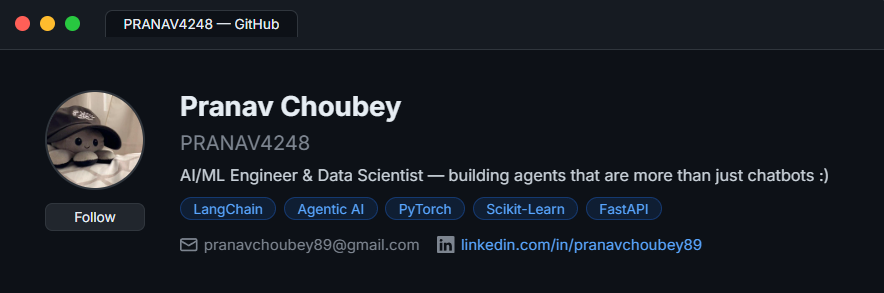

  

## 🕶️ About me -

- 🔭 Passionate programmer creating **AI Agents** that aren't just memoryless chatbots
- 🧠 Proficient in **Machine Learning**, with experience in **Generative & Agentic AI**
- 🗄️ Skilled in **DBMS, data structures & web frameworks** for scalable systems
- 🚀 Deploying **production-grade AI applications** that drive actionable insights
- ⚡ Fun fact - I'm also a material's engineer:)**

# 💻 Tech Stack:

                             

  <table><tr><td align="center" style="background:#1a1a2e;border-radius:10px;padding:18px 32px;border:1px solid #b829dd;">
    
     
    <strong><em>"Apparently GitHub wanted a strong password so I changed it to lorem45  :)"</em></strong>
  </td></tr></table>

